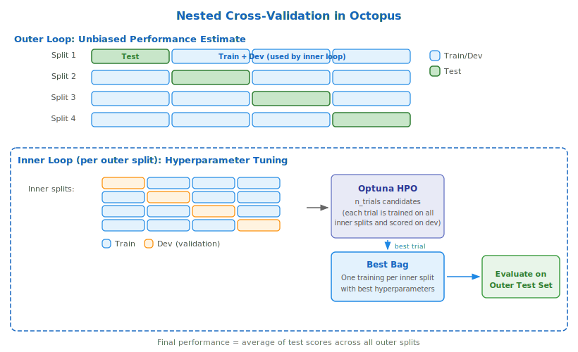

# Nested Cross-Validation

Nested cross-validation is the central evaluation strategy in Octopus. It
provides unbiased performance estimates even when hyperparameter tuning is
involved, a property that matters most when data is scarce.

## Why it matters

In a typical ML workflow you split data into training and validation sets, tune
hyperparameters on the training set, and pick the configuration that scores best
on the validation set. The problem is that the validation score now _also_
reflects how well you searched the hyperparameter space. It is no longer an
unbiased estimate of how the model will perform on truly unseen data.

For large datasets this optimistic bias is usually small. For small datasets
(< 1 000 samples) the effect can be dramatic: with fewer data points each
split is more sensitive to the exact partition, and the optimizer has a much
easier time "memorizing" the validation set.
[Cawley & Talbot (2010)](http://jmlr.csail.mit.edu/papers/volume11/cawley10a/cawley10a.pdf)
showed that this selection bias can be as large as the performance gain from
tuning itself.

Nested cross-validation solves this by adding a second layer of splitting that
cleanly separates hyperparameter tuning from performance estimation.

## What is information leakage?

Information leakage occurs when data that would not be available at prediction
time influences model training or evaluation. The result is an overly
optimistic performance estimate that does not hold on truly new data. The
selection bias described above is one form of leakage, but there are several
others. Octopus is designed to prevent all of them.

**Hyperparameter selection bias.**
When the same validation score is used both to select hyperparameters and to
report performance, the reported number is too optimistic. Nested CV prevents
this by evaluating on an outer test set that the inner tuning loop never
touches (see [How it works](#how-it-works) below).

**Correlated observation leakage.**
If your dataset contains multiple rows for the same subject (e.g. repeated
measurements from one patient), a naive random split can place some of a
subject's rows in the training set and others in the test set. The model then
"recognizes" the subject rather than learning generalizable patterns. Octopus
handles this automatically: it groups rows by `sample_id_col` and also detects
rows with identical feature vectors using a union-find algorithm. Entire groups
are kept together in the same split via `GroupKFold` / `StratifiedGroupKFold`.
See the [classification](../userguide/classification.md) and
[regression](../userguide/regression.md) user guides for how to set
`sample_id_col`.

**Feature selection leakage.**
Selecting features on the full dataset (including test data) lets information
about the test distribution influence which features are chosen. In Octopus
all feature selection modules (ROC, MRMR, Boruta) run _inside_ each outer
split and only see the train+dev portion. The outer test set never influences
which features are selected.

**Preprocessing leakage.**
Computing imputation values or scaling statistics on the full dataset
(including test data) subtly leaks test information into the training
pipeline. In Octopus the preprocessing pipeline (imputation, scaling) is fit
exclusively on the inner training partition. Dev and test partitions are
transformed using those statistics, never contributing to them.

**Runtime validation.**
As a final safeguard Octopus performs six runtime checks after every split:
it verifies that no group appears in both train and test, that row indices do
not overlap, that test splits cover all rows without duplication, and that no
group is repeated across test partitions. Any violation raises an immediate
error.

## How it works

The idea is straightforward: wrap one cross-validation loop inside another.



### Outer loop: performance estimation

The dataset is split into `n_outer_splits` splits (default: 5). In each
iteration one split is held out as the **outer test set** and the remaining
splits form the **train+dev set**. The outer test set is never used during
model training or hyperparameter tuning. It only serves as an unbiased
evaluation target.

After all outer splits have been processed the final reported performance is the
**average of the outer test scores**. This average is an honest estimate of how
the model generalizes.

### Inner loop: hyperparameter tuning

Inside each outer split the train+dev set is further divided into
`n_inner_splits` splits (default: 5). One inner split becomes the **dev set**
(validation), the rest become the **training set**. Hyperparameter
optimization then runs entirely within these inner splits:

1. **Optuna proposes** a set of candidate hyperparameters (a "trial").
2. The trial is trained on **every inner training split** and evaluated on the
   corresponding **dev split**.
3. The trial's score is the aggregated dev performance across inner splits.
4. Optuna repeats for `n_trials` iterations, guided by its TPE sampler.

Because the outer test set is never touched during this process, the final
outer test score remains unbiased.

### From trials to predictions

After hyperparameter tuning completes:

1. The best trial's hyperparameters are used to train a fresh set of models,
   one per inner split, forming a **[Bag](terminology.md#bag)**.
2. This Bag's predictions on the outer test set are computed by averaging the
   predictions of all its inner models (called
   **[Trainings](terminology.md#training)**).
3. This process repeats for every outer split.

When making predictions on new data all outer Bags contribute: their
predictions are averaged into a single ensemble prediction.

## Nested CV in Octopus

### Data splitting

Octopus creates outer and inner splits with several safeguards:

- **Stratification.** For classification tasks the target distribution is
  preserved in every split (`StratifiedGroupKFold`).
- **Group-aware splitting.** When a `datasplit_group` column is provided,
  related rows (e.g. multiple measurements from one patient) are kept together
  in the same split. This prevents data leakage from correlated observations.
- **Runtime validation.** After splitting, Octopus checks that no group
  appears in both train and test, that test splits cover all rows, and that no
  row is duplicated.

### Workflow execution per outer split

Each outer split runs the full workflow defined by the user, typically one or
more feature-selection tasks followed by an [Octo](workflow/octo.md) ML task.
Feature selection also happens inside the outer split, using only the train+dev
portion. This prevents the feature set from leaking information about the
outer test data.

### Multiple inner split seeds

Setting `inner_split_seeds` to a list of several seeds (e.g. `[0, 1, 2]`)
makes the inner loop repeat with different random splits. This creates more
Trainings per Bag and increases the robustness of both the hyperparameter
ranking and the final predictions, at the cost of proportionally longer
runtime.

## Key parameters

| Parameter | Default | Description |
|-----------|---------|-------------|
| `n_outer_splits` | 5 | Number of outer CV splits |
| `outer_split_seed` | 0 | Random seed for outer splits |
| `n_inner_splits` | 5 | Number of inner CV splits (set on the Octo task) |
| `inner_split_seeds` | `[0]` | Seeds for inner splits; more seeds = more robust |
| `n_trials` | 200 | Number of Optuna trials per outer split |
| `ensemble_selection` | `False` | Combine multiple trial Bags into a meta-ensemble |

```python
from octopus.study import OctoClassification
from octopus.modules import Octo

study = OctoClassification(
    study_name="nested_cv_example",
    target_metric="AUCROC",
    feature_cols=["feature_1", "feature_2", "feature_3"],
    target_col="diagnosis",
    sample_id_col="patient_id",
    stratification_col="diagnosis",
    n_outer_splits=5,
    workflow=[
        Octo(
            task_id=0,
            depends_on=None,
            n_inner_splits=5,
            inner_split_seeds=[0],
            n_trials=200,
        )
    ],
)
```

## Practical guidance

**Defaults work well for most cases.** With 5 outer and 5 inner splits
Octopus already trains 25 models per Optuna trial. This gives stable
estimates for datasets in the 100 to 1 000 sample range.

**When to increase splits.** If your dataset is very small (< 100 samples)
you may benefit from more outer splits (e.g. 10) to reduce variance in the
performance estimate. More inner splits help stabilize hyperparameter
selection.

**Multiple inner split seeds.** For extra robustness, set
`inner_split_seeds=[0, 1, 2]`. This triples the number of Trainings per Bag
and smooths out the effect of any single unlucky split.

**Runtime trade-offs.** More splits and more seeds mean linearly more model
fits. Octopus mitigates this with parallelization across outer splits (via
Ray) and across inner trainings within each split. See the
[FAQ](../faq.md) for details on parallelization settings.
